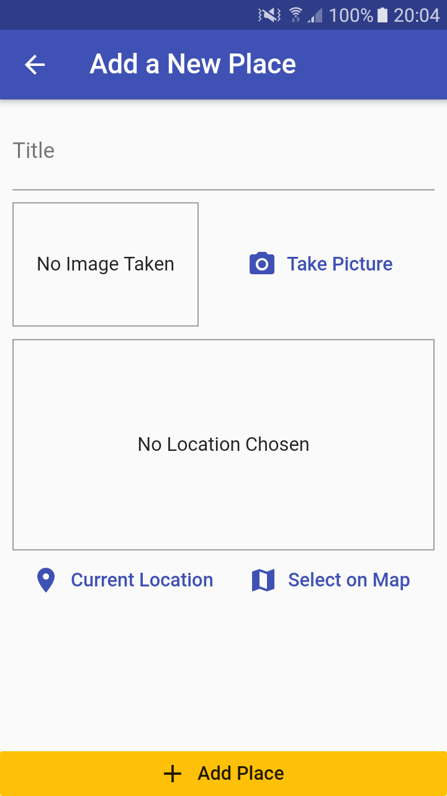
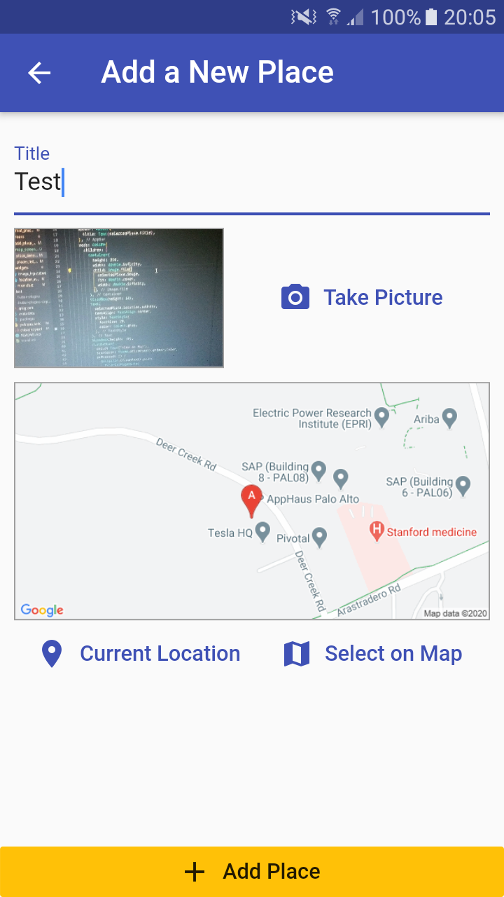
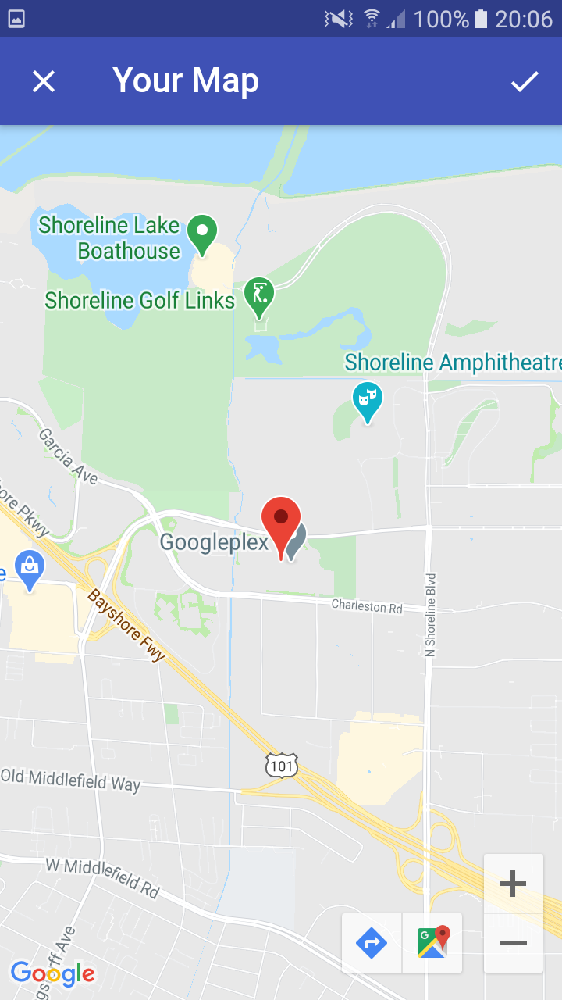
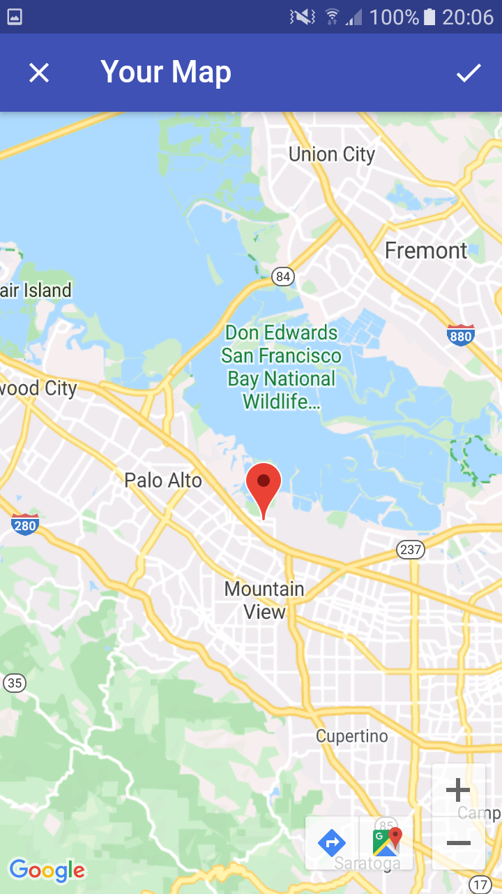
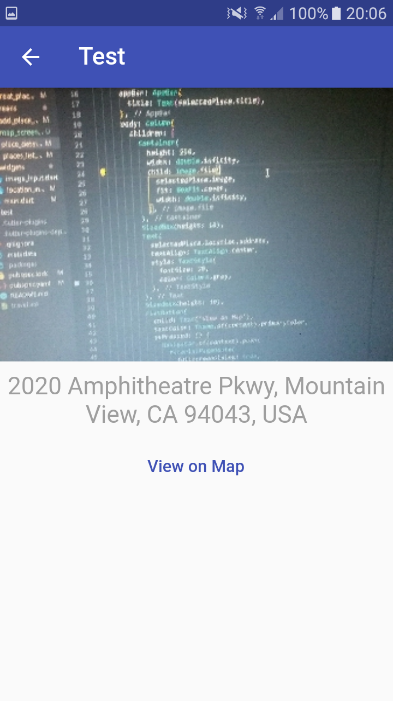

# Great Places App | Flutter

## packages

-   provider
-   image_picker
-   path_provider
-   path
-   sqflite
-   location
-   google_maps_flutter
-   http

This app is built using flutter incorporating Google Maps API and utilizing native device features.
It allows the user to create a list of amazing places which they have visited.
Users can either select their current location or select a location on the map and add it to their list along with an image of the place.

 
 
 
 
 
